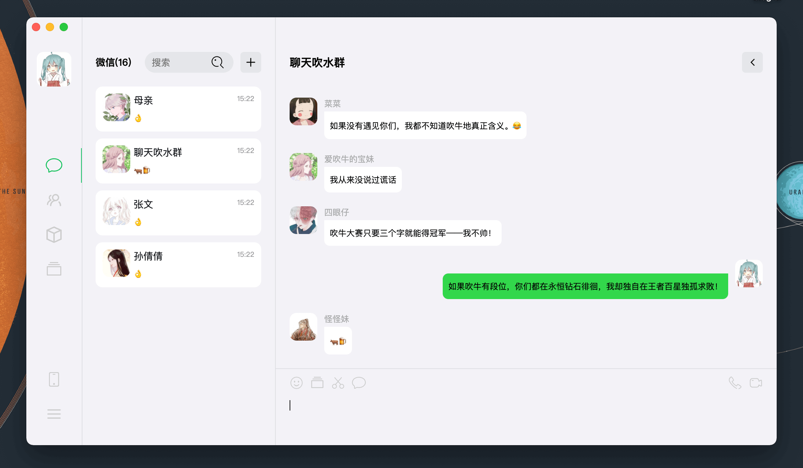

# WeTalk

更符合现代审美的微信客户端

这是一个非盈利性的开源项目，目的是探讨和研究技术。欢迎提PR。

如果需要进行二次开发，请先阅读本项目的开源协议[Apache-2.0 License](http://www.apache.org/licenses/)
If you need secondary development, please read the open source agreement of this project first

## ROADMAP

### FE

1. 准备
   - [x] 基础架构
   - [ ] 需求明确 WIP
2. 开发
   - [ ] UI还原 WIP

### BE

WIP

### 效果展示

